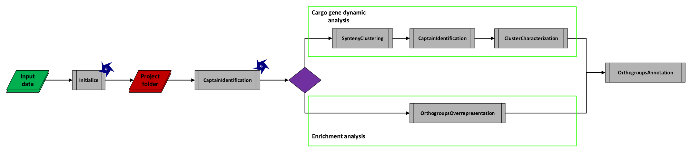

# StarCREW: Starships CaRgo Exploration Wrapper

## Overview

**StarCREW** is a bash wrapper specifically designed to systematically analyze the cargo genes of Starship elements. The wrapper is composed of seven distinct commands and creates a well-organized project folder to facilitate downstream analysis. StarCREW provides an initial analysis workflow, ranging from captain identification (to confirm upstream analysis) to the functional annotation of orthogroups within the cargo genes. The primary goal of this wrapper is to offer researchers a simple, integrated workflow for an initial exploratory analysis and comparison of Starship cargo genes. This process is expected to help identify biological patterns or generate hypotheses that can be further tested either by bioinformatic or wet-lab experimental approaches.

In addition to the main commands, StarCREW is distributed with a diverse set of auxiliary scripts. Although these scripts are primarily used for specific tasks within the main workflow, users can utilize them independently for their own purposes in other bioinformatics settings. These auxiliary scripts cover a diverse range of tasks often encountered in a genomic analysis workflow, including: 1) a modified RIP-like signal calculator, 2) filtering genes or isoforms from a GFF file based on intron density, 3) extracting gene information in batch from multiple genomic regions within a GFF3 file, 4) and other specific tasks.

## Table of contents

- [Requirements](#Requirements)
    - [System requirements](#System-requirements)
    - [Software requirements](#Software-requirements)
    - [Database requirements](#Database-requirements)
- [Installation](#Installation)
- [Input](#Input)
    - [Simple input files](#Simple-input-files)
    - [Starfish input files](#Starfish-input-files)
- [Main commands](#Main-commands)
    - [Initialize](#Initialize)
    - [CaptainIdentification](#CaptainIdentification)
    - [SyntenyClustering](#SyntenyClustering)
    - [OrthogroupsOverrepresentation](#OrthogroupsOverrepresentation)
    - [ClusterCharacterization](#ClusterCharacterization)
    - [OrthogroupsAnnotation](#OrthogroupsAnnotation)
- [Project folder organization](#Project-folder-organization)
- [Pipeline modes](#Pipeline-modes)
- [Citing StarCREW and software called by StarCREW](#Citing-StarCREW-and-software-called-by-StarCREW)
- [License](#License)

## Requirements

### System requirements

Waiting for full wrapper development to check the final requirements.

### Software requirements

This wrapper was specifically written for Linux and requires the following software and dependencies to be installed and accessible via the system path. The version numbers provided are those used during testing; for Python and R, these specific versions ensure the successful installation of all required packages, while for OrthoFinder newer versions have deprecated the --matrix argument, which would break the wrapper's workflow.

- python v3.9 with the following packages: networkx v3.6.1, biopython v1.86, gffutils v0.13, pandas v2.3.3, numpy v2.3.5, scikit-learn v1.8.0.
- java.
- hmmer v3.4.
- seqkit 2.12.0.
- blast+ v2.17.0.
- clipkit v2.7.0.
- iqtree3 3.0.1.
- gotree v0.5.1.
- orthofinder v3.1.0.
- R v4.4.3 with the following packages: ape v5.8.1, reshape2 v1.4.5, viridis v0.6.5, dplyr v1.1.4, gggenomes v1.1.2, scales v1.4.0, dendextend v1.19.1, NbClust v3.0.1, svglite v2.2.2, ggplot2 v3.5.2, ggtree v3.14.0, ggnewscale v0.5.2, syntenet v1.8.0, mrfdepth v1.0.17, optparse v1.7.5, bc3net v1.0.5.
- metaeuk v7.bba0d80.
- agat v1.5.1.
- diamond v2.1.16.
- macse v2.07.
- interproscan .
- hhsuite v3.3.0.
- foldseek v10.941cd33.

### Database requirements

The commands related to functional annotation and Transposable element identification require databases that are not distributed under this repositorie and need to be properly dowwnload:

- interproscan related databases.
- pfamA for hhblits.
- foldseek: ProstT5, PDB and alphaphold.
- Mycomobilome.

## Installation

Before installation, ensure you have `Anaconda3` and `git` installed and accessible in your system path, as they are required for the full wrapper installation. After cloning, execute the `build_StarCREW.sh` script to properly configure a conda environment, and install all necessary software dependencies and databases required by the wrapper's commands, as shown below:

```
# clone the repository
git clone https://github.com/andres2901/StarCREW.git

# Construct the environment and download require databases
cd StarCREW/
bash build_StarCREW.sh
```

## Input

StarCREW currently supports two distinct types of input data. Generally, both modes require a minimum of two kind of information: the element nucleotide sequences in fasta format and a gene prediction in GFF3 format.

An optional metadata file can also be supplied, containing as much information as the user requires. However, the user must adhere to the following specifications:

- **Format:** It must be a `.csv` file using a semi-colon (`;`) as the separator. There should be no tab characters within the file.
- **Header:** The first row must represent the header, containing the name of each column.
- **Identifier Column:** The first column must represent the name/ID of the element, and its header must be `ElementID`.

### Simple input files

This input format is intended for use when analyzing manually identified or curated Starship elements, or when you wish to study a specific subset, or the totality, of the elements retrieved from [Starbase](https://starbase.serve.scilifelab.se/).

In this scenario, you only require two basic input files:

1.  **Elements File (Multifasta):** A multifasta file containing the nucleotide sequences of the elements you intend to study.

2.  **Gene Prediction File (GFF3):** A GFF3 file containing the gene predictions for all elements listed in the `Elements` fasta file.
    - The `seqID` in the first column must be the header/ID of the element itself, not the ID of the contig from which it was extracted.
    - Similarly, the coordinates must be relative to the element's sequence, not the contig from which it was extracted.

### Starfish input files

This input mode is used when you have processed your dataset using the [Starfish toolkit](https://github.com/egluckthaler/starfish) and wish to analyze the obtained elements.

**It is strongly recommended** that you first perform an initial inspection and removal of false positives, as described in the Starfish [step-by-step tutorial](https://github.com/egluckthaler/starfish/wiki/Step-by-step-tutorial).

To use StarCREW, you must have the results from both the `geneFinder` and `elementFinder` modules of Starfish. StarCREW utilizes three resulting Starfish files and one user-constructed file:

1.  **Elements File (Multifasta):**
    - This is the `*.elements.fna` file resulting from the `starfish summarize` command.
    - This file contains the nucleotide sequences of the elements to be studied.
    - **Recommendation:** Ideally, the user should remove elements identified as false positives during their preliminary inspection.

2.  **Boundaries File (Metadata):**
    - This is the `*.elements.feat` file resulting from the `starfish summarize` command.
    - This file contains the element metadata from Starfish, which is used for delimiting the element gene content information.
    - **Recommendation:** The user should maintain the header and remove the corresponding false positive elements from this table.

3.  **Captain File (Multifasta):**
    - This is the `*_tyr.filt_intersect.fas` file resulting from the `starfish annotate` command.
    - This file contains the putative YR recombinase genes identified by Starfish.
    - **Note:** While filtering is not strictly required, users working with large datasets can reduce the file to include only Captains of true positive elements to decrease run time.

4.  **Gene Prediction Path File (TSV):**
    - This is a user-constructed TSV file with a two-column structure (similar to the optional Starfish input file): `genome code` and `path to GFF`.
    - **Crucial Points:**
        - The `genome code` must be identical to the code used in the Starfish analysis.
        - The GFF path must point to the original GFF file, and not the files returned by the `starfish format` or `starfish format-ncbi` commands.
        - This wrapper requires the gene, mRNA, intron, exon, and CDS information, and needs the original contig `seqID` to be maintained. The files returned by the `starfish format` or `starfish format-ncbi` commands only retain mRNA information and alter the IDs to suit the Starfish workflow.
    - **Acquisition:** The user can obtain the necessary GFF file using the same command line as detailed in the Starfish step-by-step tutorial:

```
realpath gff3/* | perl -pe 's/^(.+?([^\/]+?).final.gff3)$/\2\t\1/' > ome2gff.txt
```

## Main commands

The wrapper is composed of seven main commands. Most of these commands are sequential (meaning they must be run in a specific order) while others can be executed independently for specific purposes. The only command that is required for the rest of the workflow and must always be run first is the `StarCREW Initialize` command, which generates the dedicated project folder.

### Initialize

```
Script to organize the working directory to run the subsequent commands in the workflow.

Syntax: StarCREW Initialize [ -help ] -f <filte_path> -g <file_path> [ -m <string> -gc <integer> -r <integer> -mg <integer> -o <string> -b <file_path> -s <character> -c <file_path> -M <file_path> --overwrite ]"

Required args:
-f, --fasta:  multifasta file wih the elements to study.

Required args with Default:
-m, --mode: Mode of the input to initialize (Defaul = Simple) [Available mode: Simple, Starfish]
-gc, --gc: integer value of gc content to filter out elements with too low gc content (Default = 0) [range: 20 - 45]
-r, --rip: integer value of the minimum coverage of the element to be possibly affected by RIP to be filter out (Default = 0) [range: 30 - 80]
-mg, --minGene: Minimum number of genes in an element to be include in the dataset (Default: 8) [range: 5 - 100]
-o, --outDirectory: Specify working directory  name (Default = WorkingDirectory).

Required args in 'Starfish' mode:
-g, --gff: 2 column tsv: genome code, path to GFF. The path should be to the original gff files and not the ones formatted to run starfish.
-b, --boundaries: *.elements.feat file output of 'starfish summary' command.
-s, --separator: character separating genomeID from featureID that was used for Starfish run.
-c, --captains: *_tyr.filt_intersect.fas file output of 'starfish annotate' command.

Required args in 'Simple' mode:
-g, --gff: Path to the GFF file containing gene predictions with element-relative coordinates for all elements in the fasta file.

Optional args:
-M, --Metadata: csv file delimited by semicolon with the metadata information: ElementID;<data1>;<data2>;....
--overwrite: Flag to overwrite in case there is already a previous run (Default: off)
-help: Display this help message.
```

This command filters the input data based on a series of criteria and organizes the resulting database within a project folder. This folder serves as the starting point for all subsequent commands. The user should be aware that the element naming may change, with a specific, new ID designated for the Project. However, an association file will always be provided to map the original element ID to the new ID.

The command provides three main filtering approaches you can utilize:

1. RIP-like Signal Filtering: If enabled, this filter removes any element that shows a Repeat-Induced Point Mutation (RIP)-like signal over an specific threshold.
    - For this purpose, we utilize a custom Python script inspired by [theRipper web server](https://theripper.hawk.rocks/#/home), with modifications to the default thresholds based on [Margolin et al. 1988](https://pmc.ncbi.nlm.nih.gov/articles/PMC1460257/) and [Lewis et al. 2009](https://pmc.ncbi.nlm.nih.gov/articles/PMC2661801/).
    - The removal of elements is performed through the following steps:
        - **Index Calculation:** Calculation of the 'rip substrate index', 'rip product index', and 'rip composite index' in 1000 bp windows with a 250 bp sliding step.
        - **RIP-like Window Identification:** A window is identified as RIP-like if the 'rip substrate index' < 1.05, the 'rip product index' > 0.8, and the 'rip composite index' > 0.
        - **RIP-like Region Calculation:** Three sequential RIP-like windows must be identified, and only the overlapping section among these windows is designated as a RIP-like region. This strictness is implemented to avoid over-identifying RIP-like regions nd will lead to a reduced value of the coverage of the element with the RIP-like signal.
        - **Coverage Calculation:** The ratio of nucleotides in RIP-like regions to the full element length is calculated. This specific coverage value is used to perform the element filtering.
2. GC Content Filtering: This filter removes any element with a GC content percentage below a specific threshold.
    - The rationale behind this filter is to remove elements that may have undergone RIP or similar deleterious processes but do not exhibit a strong RIP-like signal.
    - The allowed range is based on previous literature concerning the general genome GC content of Pezizomycotina species.
3. Gene Content Filtering: This filter removes elements that are empty or contain a very low number of cargo genes.
    - Since the primary goal of this wrapper is to analyze cargo content, maintaining elements without sufficient cargo genes is inefficient. This filter ensures that only elements useful for downstream analysis are retained.

When using the 'Starfish' input mode, the provided data undergoes specific preprocessing before entering the main pipeline:

1.  **GFF Information Update:** The gene information from the original GFF files is extracted and updated based on the positions provided in the metadata file resulting from the Starfish run.
2.  **Captain Gene Prediction:** As Starfish performs a *de novo* prediction of Captain genes, we must re-execute a similar approach to obtain the complete genetic information (exon, intron, CDS, etc.) for these genes. We use a modified version of the Starfish approach:
    - Using the YR recombinase database obtained from Starfish, MetaEuk is run against the nucleotide file, requiring a minimum sequence identity of 0.95 and a minimum coverage of 0.95.
    - If a previous gene model exists at the same position, this command selects the longest gene model. This differs from the Starfish logic, which consistently selects the MetaEuk gene model in such conflict cases.

### CaptainIdentification

```
Script to identify captain genes within each element and construct a phylogenetic tree based on these captains.
It executes five main steps:
1. Run hmmscan using hmm profiles of specific domains in captains against the proteome of each element.
2. Processes the data to identify Captains and regions suitable for phylogenetic analysis. Three confidence levels can be used for Captain identification:
  2.1 Only a match with the Captain HMM profile from Starfish. WARNING: This may lead to false positive identifications and result in an unreliable phylogenetic analysis.
  2.2 A match with the Captain HMM profile plus a match with the DUF3435 HMM profile.
  2.3 A match with the Captain HMM profile and DUF3435 HMM profile plus a match with HMM profiles associated with the YR Recombinase Active Site.
3. For elements lacking a confident Captain gene, the script searches for a putative Captain pseudogene at the beginning and end of the element.
4. Aligns exonic sequences using MACSE (with amino acid output) and preprocesses the alignment with Clipkit.
5. Runs maximum-likelihood phylogenetic tree inference, when there at least two unique captain sequences:
  5.1 Run IQ-TREE with 1000 UFBotstrap and 1000 sh-aLRT if there at least 4 unique sequence, in other case run it without support.
  5.2 Collapsed near-zero and low-support (when available) branches.
  5.3 mid-root the tree.

There are three available mode:
-Cluster: Analyzes and performs all five steps per cluster, and remove elements without a suitable Captain gene or pseudogene from the main dataset.
-FullAll: Analyzes and performs all five steps on the whole dataset, and remove elements without a suitable Captain gene or pseudogene from the main dataset..
-AllID: Analyzes and performs only the first three steps (Identification) on the whole dataset, and remove elements without a suitable Captain gene or pseudogene from the main dataset.

Syntax: StarCREW CaptainIdentification [ -help ] -w <directory_path> [ -l <integer> -c <integer> -m <string> -t <integer> -ms <integer> --overwrite ]

Required args:
-w, --workingDirectory: Specify the working directory where all data are stored.

Required args with Default:
-m, --mode: specified the mode (Default = AllID) [Available mode: Cluster, FullAll, AllID].
-l, --length: Minimum length of the protein to be identify as captain (Default: 250) [range: 200 - 800].
-c, --confidenceLevel: Minimum confidence level to call a captain. Note: the script is always going to try to return the captain with the highest level of confidence (Default: 2) [range: 1 - 3].
-r, --rangeKb:The distance (as a number of kilobases) from the beginning or end of the element within which a gene must fall to be considered a captain (Default: 10) [range: 3 - 20]

Required args with Default in 'Cluster' mode:
-ms, --minSize: Minimum size of a Cluster to be include in the analysis when running the 'Cluster' mode (Default = 4) [range: 4 - 10]

Optional args:
-t, --threads: Number of threads to use for phylogenetic tree inference (Default: 1).
--overwrite: Flag to overwrite in case there is already a previous run of CaptainIdentification (Default: off)
-help: Display this help message.
```

The identification of the Captain gene is based on its basic description: a Tyrosine Recombinase (YR recombinase) containing a DUF3435 domain ([Gluck-Thaler et al. 2022](https://academic.oup.com/mbe/article/39/5/msac109/6588634), [Gluck-Thaler & Vogan 2024](https://academic.oup.com/nar/article/52/10/5496/7660083?login=true)). For this purpose, we construct or retrieve the following three sets of HMM profiles:

1.  **Starfish Captain HMM:** The HMM profile for Captain proteins distributed with the [Starfish toolkit](https://github.com/egluckthaler/starfish).
2.  **DUF3435 HMM:** The HMM profile for the DUF3435 domain (Pfam accession: PF11917.13).
3.  **YR Recombinase Active Site HMMs:** A database of HMM profiles associated with the active domain of YR recombinases, including:
    - DNA breaking-rejoining enzymes (Superfamily accession: SSF56349)
    - Phage integrase family (Pfam accession: PF00589.27)
    - Integrase catalytic core (CATH-Gene3D accession: G3DSA:1.10.443.10)
    - TYR_RECOMBINASE (PROSITE accession: PS51898 version 3)
    - TYR_RECOMBINASE_FLP (PROSITE accession: PS51899 version 3)

To be considered a "true" Captain, the predicted gene must pass a series of strict filters. This approach differs from the original Starfish methodology, which relies on a single filter (matching the Captain HMM profile). Our increased strictness aims to remove "false positive" or highly "degraded" elements lacking a strong Captain signal. The implemented filters are:

1.  **HMM Profile Count:** Must match a minimum number (defined by the user) of the HMM profiles listed above. In case the threshold is below '3', the command will always have a preference for those genes with higher number of matches.
2.  **Minimum Length:** The protein must meet a minimum length of amino acids, which is modifiable by the user.
3.  **Exon Count:** The exon count must be between 2 and 11. This constraint is based on the observation that Captains in the current dataset contain mostly intron-containing gene models. Also, preliminary analysis indicated that gene models with an excessive number of introns often correspond to pseudogenes, where gene predictors introduce many introns to avoid intra-frame stop codons.
4.  **Genomic Position:** The gene must be located at the beginning of the element in the positive strand (or at the end if the element sequence is in its reverse complement). The acceptable range for this position is defined by the user.

In the scenario where no gene passes the filters to be called a 'Captain' in an element, a pseudogene will be identified if any sequence homology exists based on the exon sequence of known Captain genes.

**Note 1:** Be aware that this command will always put aside elements that do not have an identifiable Captain gene or pseudogene into a dedicated folder called `Captainless_elements/`, as these elements are not useful for the downstream analysis.

**Note 2:** These filters are still a work in progress as the community continues to gather and document information about the gene model and protein structure of Captains. Currently, available literature lacks comprehensive documentation on this specific gene model.

After a successful run, the following files should be found in the main output directory:

- **`CaptainsID.txt`**: If Captain genes were identified in at least one element, this file stores the gene ID for all of those elements.
- **`Captains_exon.fa`**: If a Captain gene was identified in at least one element, this multifasta file stores their Coding DNA Sequence (CDS).
- **`Captains_pseudo.fa`**: If a pseudogene sequence was identified in at least one element, this multifasta file stores the pseudogene sequence.
- **`CaptainPhylogeny.nw`**: If the command was run in the `Cluster` or `FullAll` mode, this file stores the phylogenetic tree of the Captain genes in Newick format. If this file is not found, please check the log generated during the run for any WARNING message.

### SyntenyClustering

```
Script to perform clustering of elements based of the syntenet pipeline using DIAMOND for sequence similarity search.
It executes six main steps:
1. Executes the initial data preprocessing step required by the syntenet pipeline.
2. Runs DIAMOND using the preprocessed data.
3. Runs the interspecies synteny command of syntenet to identify regions with gene collinearity between elements.
4. Summarizes the results of syntenet on four possible modes:
 a. Raw: Return pairs that have a minimum of 8% of shared collinear genes. WARNING: This mode may yield a high rate of false positives.
 b. SSP: Return only pairs with strong synteny (Check wrapper documentation for more information).
 c. FilterBlast: Returns pairs that have been filtered using a BLAST-based approach at the nucleotide level.
 d. FilterMetric: Filter and update collinearity based on a metric system (Check wrapper documentation for more information).
5. Defines initial clusters of elements and performs a spectral clustering process to identify potential subclusters.
6. Organizes the final data output for each identified cluster.

Syntax: StarCREW SyntenyClustering [ -help ] -w <directory_path> [ -m <string> -a <integer> -g <integer> -n <integer> -s <integer> -t <integer> -th <float> -p <string> --captainInfo --overwrite ]

Required args:
-w, --workingDirectory: Specify the working directory where all data are stored.

Required args with Default:
-m, --mode: Specified the mode to run the summarizing process of synteny results (Default = FilterBlast) [Available mode: Raw, SSP, FilterBlast, FilterMetric].
-a, --anchors: Number of minimum anchor points for syntenet to call a collinear region (Default = 8) [range: 3 - 25].
-g, --gaps: Number of maximum allowed gaps between anchor points for syntenet to call a collinear region (Default = 8) [range: 5 - 25].
-n, --minNodes: Minimum number of nodes in a cluster for spectral clustering to be attempted (Default: 4).
-s, --minSize: The minimum desired size for any final sub-cluster (Default: 2).
-th, --threshold: The minimum modularity score for a set of subcluster to be accepted (Default: 0.05) [range: -0.5 - 1.0].
 
 Required args with Default in 'FilterBlast' mode:
-fs, --fragmentSize: The minimum fragment size of a blast alignment to be used for blastn filter (Default: 2000) [range: 1000, 5000].
-ms, --mergeSize: The minimum merge fragment size to be used for blastn filter (Default: 5000) [range: 2000, 10000].
-i, --identity: The minimum percentage of identity of a blast alignment to be used for blastn filter (Default: 70.0) [range: 60.0, 90.0].
-c, --coverage: The minimum coverage of the filter merge fragments for a pair to pass the filter (Default: 20.0) [range: 10.0, 50.0].

Optional args:
-t, --threads: Number of threads for searching software (DIAMOND and blast) (Default: 8).
--captainInfo: Flag to check and used the captain exon/pseudoexon information for the cluster. This will reduce time in downstream analysis. (Default: off).
--overwrite: Flag to overwrite in case there is already a previous run of SyntenyClustering (Default: off).
-help: Display this help message.
```

The clustering of elements is based on collinearity regions identified using the [syntenet](https://pubmed.ncbi.nlm.nih.gov/36539202/) pipeline. The user can define two critical parameters for collinearity analysis:

- **Anchor Points:** Genes that are shared between two elements in the same relative position.
- **Gaps:** Genes that are not shared in the region but are located between shared anchor genes.

For the purpose of clustering, we use two specific collinearity metrics:
1.  **General Collinearity Percentage (GCP):**
    - This value is returned by syntenet, which employs the [MCScanX algorithm](https://pubmed.ncbi.nlm.nih.gov/22217600/), and represents the total collinearity of the pair.
    - MCScanX calculates GCP using the formula: $GCP= \frac{\sum CG}{\sum TG} \times 100$, where $CG$ equals the total number of collinear genes between the two elements, and $TG$ represents the total number of genes in both elements combined.
2.  **Element Collinearity Percentage (ECP):**
    - This value is calculated by the command using the syntenet output and the gene prediction annotation for both elements. Two ECP values are calculated, one for each element in the pair.
    - ECP is calculated by the following formula: $ECP_x= \frac{\sum CG_x}{\sum TG_x} \times 100$, where $CG_x$ equals the total number of non-duplicate collinear genes in element $x$, and $TG_x$ represents the total number of genes in element $x$.

A preliminary filter is performed by removing any pair with a GCP below 8%, as initial testing indicated these pairs consistently represented false positives. After this basic filtering, the final pairs can be returned using one of four criteria-based modes:

1.  **Raw Mode:**
    - Returns all pairs remaining after the basic GCP < 8% filtering.
    - **WARNING:** This mode may yield a high rate of false positives and requires significant manual effort to confirm the results.
2.  **Strong Syntenic Pairs (SSP):**
    - Returns all pairs with a $GCP \ge 41$%.
    - For pairs with a relatively large difference in length and/or gene content, this mode also accepts pairs where $ECP_x \ge 45$% and the ratio between the ECPs is at least $1.8$, meaning $\frac{ECP_x}{ECP_y} \ge 1.8$.
    - **Note:** These values were calculated during preliminary testing. They correspond to a threshold where no 'false positive' pairs were found, and a clear 'good' diagonal was visualized in a nucleotide dot-plot.
3.  **Blastn Filter (FilterBlast):**
    - This was the initial filtering approach design for the command, inspired by the BLAST result cleaning process described in [Westerberg et al. 2021](https://pubmed.ncbi.nlm.nih.gov/38218923/) before LTR network construction.
    - All pairs not considered SSP are further analyzed using an all-versus-all blastn search, employing parameters similar to those of the [YASS web server](https://bioinfo.univ-lille.fr/yass/index.php).
    - The raw BLAST results are processed through the following steps to define the final maintained pairs:
        - Remove hits below user-defined thresholds for fragment size and identity percentage.
        - Merge overlapping hits.
        - Remove resulting hit/overlap regions below a user-defined threshold.
        - Calculate the sequence coverage of all hits between the two elements.
        - Filter out pairs that have a coverage below a user-defined threshold.
4.  **Metric-Based Filter (FilterMetric):**
    - This secondary filtering approach is inspired by the [ClusterBlast]((https://docs.antismash.secondarymetabolites.org/modules/clusterblast/)) ranking system.
    - All pairs are analyzed using a metric system calculated from the syntenet collinearity file and the raw DIAMOND search data. The GCP and ECP of the pair are subsequently updated based on the metric score.
    - Metric System Details:
        - Identify anchor pairs from the collinearity file and defined the expected points as $Anchor\ pairs \times 2$.
        - Select these anchor pairs from each DIAMOND search direction ($x \rightarrow y$ and $y \rightarrow x$). **Note:** Because the MCScanX algorithm does not require hits to be reciprocal to define an anchor point, we search individually for each direction.
        - Filter hits with a length $< 100 \text{aa}$ and identity percentage < 60%.
        - Each remaining hit contributes **1 point**. Reciprocal hits for a single anchor pair thus return **2 points**.
        - Bonus Points: Hits with identity percentage $\ge 95$% receive $0.1$ extra point per $200 \text{aa}$ of alignment length. Example: A hit with 98% identity and $350 \text{aa}$ alignment length gives $0.175$ extra points.
        - **Acceptance Criteria:** A pair is accepted if the obtained points are equal to or higher than the number of anchor points defined by the user. If the user-defined anchor point parameter is less than 6, the threshold will be **6** to prevent 'false positive' results from using a low metric threshold.
        - **GCP/ECP Update:** A ratio is defined as $\frac{Obtain\_points}{Expected\_points}$. The GCP and ECP of the pair are then updated by multiplying them by this ratio. **Note:** If a pair's ratio is higher than 1 (due to bonus points), the ratio is capped at 1 to prevent GCP or ECP from exceeding 100%.

Once the final set of filtered pairs is obtained, a graph-based clustering process is performed:

1.  **Graph Creation:** A weighted undirected graph is created using the GCP as the edge weight. Elements without any connection are excluded from the graph.
2.  **Cluster Definition:** A cluster is defined as a set of connected elements. **Note:** Due to the nature of connected components, not all elements inside a cluster may have a direct connection between them, and therefore might not share any sequence or cargo similarity.
3.  **Subclustering:** For further resolution, an initial step of modularity  spectral clustering is performed iteratively on clusters that meet a minimum size defined by the user. This process follows:
    - **3.1. Behavior check:** The Louvain method is performed to identify the inherent cluster behavior. If cluster behavior is detected, the algorithm proceeds with an initial $k$ value (the desired number of clusters) calculated as: $k = \max(2, \text{Clusters}_{\text{louvain}} - 2)$
    - **3.2. Clustering:** Perform spectral clustering using the current $k$ value.
    - **3.3. Filtering:** Subclusters are filtered based on two criteria:
        - 1) No subcluster has a number of elements below a user-defined threshold.
        - 2) The Modularity score is higher than a user-defined threshold.
    - **3.4. Decision:** Based on the filtering result, a decision is taken:
        - Pass: If both criteria are met, the modularity score threshold is updated to the current $k$ modularity score, $k$ is incremented ($k = k + 1$), and the process returns to step 3.2.
        - Fail: If either criterion fails, the subclusters from the previous $k$ value are maintained. If this occurs on the first iteration, no subclusters are identified.

After a successful run of the clustering command, the following files and directories should be found in the main output directory:

- **Cluster(s) directory**: One dedicated directory will be created for each cluster identified, named using its unique Cluster ID.
- **Cluster_stats.txt**: This file stores the basic statistics for each cluster, which include: the total number of elements (size) and the number of subclusters identified.
- **main_cluster.txt**: MCL-formatted group file detailing the main clusters and the elements belonging to each one.
- **sub_clusters.txt**: MCL-formatted group file detailing the subclusters and the elements belonging to each one.
- **network_edges.txt**: A table containing the edge information necessary for visualization in Cytoscape. The weight column corresponds to the GCP (General Collinearity Percentage) value of the pair.
- **node_attributes.txt**: A table containing the node (element) attributes required for visualization in Cytoscape. If metadata was provided during `StarCREW Initialize`, that information will be appended to this file.

### ClusterCharacterization

```
Script to run the characterization of each cluster.
This script perform eight steps per cluster:
1. Identify orthogroups through OrthoFinder.
2. Perform all-vs-all Blastn for synteny visualization.
3. Perform a hierarchical clustering of the elements based on Orthogroup gene count including singletons.
4. Determine the full conection of the cluster and create a cargo orthogroups heatmap and synteny image for the cluster.
5. Identify possible individual nesting events inside the cluster.
6. Identify core genes in the cluster in two ways:
 6.1. General core: orthogroups that are present in at least 80% of the elements in the cluster.
 6.2. Specific core: Orthogroups that are present in at least 80% of the elements for subclusters generated at a 0.8 height of the hierarchical tree of cargo content.
   6.2.1. Divide the Cluster in subclusters of a height above 0.8 in the hierarchical clustering.
   6.2.2. If subslusters are present, identify core genes in each one that have at least 5 elements using the same logic of general core.
7. If subclusters are present it try to identify putative cargo movement events and try to avoid 'General core' genes.
8. Determine if there are discordances at 'Clade' level between Cargo hierarchical clustering and Captain phylogenetic tree.

Syntax: StarCREW ClusterCharacterization [ -help ] -w <directory_path> [ -t <integer> --overwrite ]

Required args:
-w, --workingDirectory: Specify the working directory where all data are stored.

Required args with Default:
-t, --threads: Number of threads for orthofinder and blast (Default: 8)

Optional args:
--overwrite: Flag to overwrite in case there is already a previous run of ClusterCharacterization (Default: off)
-help: Display this help message.
```

This command is designed to characterize the cargo gene dynamics within each element cluster. The command initially performs a hierarchical clustering tree of the elements within the cluster to visually identify their evolutionary history using as information the Orthogroup gene count (including singletons). It also attempts to identify any nesting events between elements inside the cluster. If your input results originate from a Starfish run, the identified nesting events should match those found in the `*.elements.feat` metadata file.

The main goal of this command is to identify two relevant groups of genes within each cluster:

- **Core Genes:**
    - We use a loose definition of "core gene" in this context. While core genes are generally defined as genes present in all genomes of a dataset, or in a less strict definition (often called soft core) as genes present in at least 95%-98% of genomes, this strict threshold is inappropriate here. This is due to the inherent variability of cargo genes across different element haplotypes and the nature of the cluster definition in this wrapper.
    - Therefore, "core genes" here are defined as those present in at least 80% of the elements in a cluster or subcluster.
    - Though technically these are accessory genes based on the used threshold, we maintain the "core" name to signify that these genes are quite common within a given cluster/subcluster compared to the highly variable remainder. The primary idea is to identify genes that tend to be maintained in the element over evolutionary time.
- **Movement Genes:**
    - This set of genes is identified based on specific presence/absence patterns that suggest their introduction into a different element was caused by horizontal gene movement from one element to another.
    - This analysis is performed only between subclusters (as defined by the [SyntenyClustering](#SyntenyClustering) command), meaning comparisons are not conducted on a pairwise, element-by-element basis.

Finally, the command attempts to determine discordances between the Captain phylogenetic tree and the cargo hierarchical clustering. The comparison is deliberately made at the 'clade' level (instead of comparing individual elements) due to the inherent uncertainty of bifurcations and polytomies in both the Captain phylogenetic tree and the cargo hierarchical tree. This process occurs as follows:

1.  **Captain Tree Transformation:** The Captain phylogenetic tree is transformed into a hierarchical cluster tree.
2.  **Clade Identification:** A suitable number of clusters, which we are calling 'clades', is identified within the transformed Captain tree.
3.  **Cargo Subclustering:** The cargo hierarchical cluster tree is then subclustered into the same number of 'clades' as identified in the Captain tree.
4.  **Comparison:** The resulting subcluster structures from the cargo and Captain trees are formally compared to identify discordances.

After a successful run of the characterization command, the following files and directories should be found in the main output directory:

- **Core/**:
    - This folder contains information about the core orthogroups identified (if any).
    - It includes:
        - A subfolder containing multifasta files of the protein sequences per orthogroup.
        - File(s) listing the gene IDs, named by the core gene group (general or specific) they correspond to.
        - A presence/absence matrix of these core genes across the elements.
- **Movement_genes/**:
    - This folder contains information about the orthogroups identified as potentially being associated with movement events (if any).
    - It includes:
        - A subfolder containing multifasta files of the protein sequences per orthogroup.
        - File(s) listing the gene IDs, named by the subcluster where the gene was identified.
        - A presence/absence matrix of these movement genes on the elements that allegedly participated in the movement.
- **Figures/**:
    - This directory contains a set of resulting figures. The number and specific images can vary depending on the information extracted from each cluster.
    - Figures that can be found include:
        - Heatmap of Cargo orthogroups.
        - Cargo hierarchical tree paired with a nucleotide synteny visualization.
        - Tanglegram comparing the Captain phylogenetic tree and the cargo hierarchical clustering at the 'clade' level.
        - Figure showing nucleotide synteny visualization of elements between which cargo is putatively believed to have moved.
        - Figure showing nucleotide synteny visualization of elements between which cargo is putatively believed to have moved.
- **CargoHierarchicalTree.nwk**:
    - The hierarchical clustering tree of the cargo genes in Newick format.

### OrthogroupsOverrepresentation

```
Script to identify orthogroups that are overrepresented in a specific dataset.
This script perform three major steps:
1. Run Orthofinder with DIAMOND ultra-sensitive mode.
2. Remove orthogroups assocaited with captains.
3. Perform the analysis depending on the selected mode:
  3.1. Outliers: Identified orthgroups that have an abnormal number of representative in the dataset using interquartile (IQR) fences [IQR = Q3 - Q1], depending on three approches for this kind of outlier identification:
    3.1.1. Standard: Identified orthogroups as outliers using as fence the following value: Q3 + n * IQR.
    3.1.2. Skew: Identified orthogroups as outliers using as fence the following value: Q3 + n*e^3MC * IQR.
  3.2. Enrichment: Identified orthogroups enriched in a group of elements based on qualitative variables in the metadata using the one-sided Fisher's exact test.

Syntax: StarClust OrthogroupsOverrepresentation [ -help ] -w <directory_path> [ -m <string> { -a <string> -n <integer> | -c <string> -v <string> } -t <integer> { --overwrite | --skip-orthofinder } ]

Required args:
-w, --workingDirectory: Specify the working directory where all data are stored.

Required args with Default:
-m, --mode: Define the mode that will be used to flag orthogroups (Default = Outliers) [Available mode: Outliers, Enrichment].

Required args in 'Outliers' mode with Default:
-a, --approximation: Define the IQR approximation that is going to be used to defined outliers (Default = Standard) [Available mode: Standard, Skew].
-c,--coefficient: In the case of 'IQR' rule, determine the coefficient for the fence definition (Default = 1.5) [range: 1 - 3].

Required args in 'Enrichment' mode:
-n, --name: column name of the variable in the metadata file to be used.
-v, --value: value from the variable to be compare against the rest.

Required args in 'Enrichment' mode with Default:
-p, --pValue: p-value to determined if an orthogroup is significantly enriched (Default = 0.05) [range: 0.001 - 0.1].

Optional args:
-t, --threads: Number of threads (Default = 8)
--overwrite: Flag to overwrite in case there is already a previous run of OrthogroupsOverrepresentation. Not compatible wit '--skip-orthofinder' flag (Default: off)
--skip-orthofinder: Flag to skip orthofinder in case a previous run was done and only want to change the mode, rule or percentile of the analysis. Not compatible with '--overwrite' flag (Default: off)
-help: Display this help message.
```

This command is designed to identify orthogroups that migth be enrich in a given dataset. Before running this command, the command `StarCREW CaptainIdentification` needs to be run. All othogroups (including singletons) will be used to perform the statistical analysis base on the mode selected by the user:

- **Outliers:** In this case a general comparison of orthogroup count will be taken. In general, the idea is to identified outliers using two different approximations of the Interquartile range (IQR) fence. The IQR is calculated as follows: $\text{IQR} = \text{Q3} - \text{Q1}$, where $Q1$ and Q3 represent the first and third quartile of the data, respectively. The two available approximations are:
    - **Standard:** In this case the standard upper IQR fence is used to define outliers. This fence is calculated as: $\text{Fence} = \text{Q3} + n * \text{IQR}$, where $n$ is a positive float coefficient used for the fence calculation.
    - **Skew:** In general, orthogroup size distribution of cargo genes in Starships elements tend to have a right-skewed behaviour. In this cases, it is ideal to use an approach that take into accoun this type of behaviour. For IQR, there's a version that use the medcouple that is a metric for skewness. In this case, the upper fence is calculated as: $\text{Fence} = \text{Q3} + ne^{3\text{MC}} * \text{IQR}$, where $n$ is a positive float coefficient used for the fence calculation and $MC$ is the medcople metric for the dataset.
- **Enrichment:** It identified orthogroups enriched in an specific group of elements based on a qualitative variable available in the metadata file of the elements using the one-sided Fisher's exact test and the Benjamini-Hochberg approach for p-value adjust for multiple comparison.

After a successful run of the annotation command, the following files and directories should be found in the main output directory:

- **Orthogroups/:** A folder containing the FASTA files for orthogroups identified as outliers or enriched, depending on the selected running mode. This folder will only be created if such orthogroups are successfully identified.
- **OrthogroupsSizeHistogram.svg:** Histogram of the orthogroups size that include a dotted line delimitating the upper fence use in 'Outliers' mode.
- **Overrepresented_orthogroups.txt:** A TSV file detailing the Orthogroup ID and size for those identified as outliers.
- **Enrihment_results.txt** A TSV file containing the full results of the Fisher’s exact test.
- **Enrich_orthogroups.txt:** A TSV file specifically filtering for orthogroups with significant p-values from the Fisher’s exact test. If no significant orthogroups are identified, this file will not be generated.

### OrthogroupsAnnotation

```
Script to run a functional annotation for orthogroups.
This script perform three steps:
1. Organize the Orthogroups that are selected base on the mode.
 1.1 Core: Orthogoups that were identify as core by the ClusterCharacteriation command.
 1.2 MoveAssociated: Orthogoups that were identify as part of a putative movement event between subclusters by the ClusterCharacterization command.
 2.3 All: All orthogroups identify by the ClusterCharacterization command.
 2.4 Overrepresented: Orthogroups that were identified as Overrepresented by the OrthogroupsOverrepresentation command.
2. Perform the characterization of the Orthogroup proteins with three approaches:
 2.1 InterProScan: Using all default applications except COILS and MOBIDB.
 2.2 Foldseek: Search for homologs proteins against a database based on the 3D structure.
 2.3 hhblits: Search domains against the PfamA database.
3. Summarize the results of the previous step:
 3.1 Internal summary: For each Orthogroups summarize the results per protein in a csv
 3.2 General summary: Return a summary for the Orthogroup under the assumption that all proteins in each Orthogroups have the same function. It return only those 'chracteristics' that are shared for at least 50% of the proteins in the Orthogroup.

Syntax: StarCREW OrthogroupsAnnotation [ -help ] -w <directory_path> [ -m <string> -f <string> -t <integer> --overwrite ]

Required args:
-w, --workingDirectory: Specify the working directory where all data are stored.

Required args with Default:
-m, --mode: Define the orthogroups to be analyzed (Default = Core) [Available mode: MoveAssociated, Core, All, Overrepresented].
-f, --foldseekdb: Name of the Foldseek database to use (Default = afdb_swissprot) [Available: pdb, afdb_swissprot].
-t, --threads: Number of threads for all analysis (Default: 8).

Optional args:
--overwrite: Flag to overwrite in case there is already a previous run of OrthogroupsAnnotation (Default: off).
-help: Display this help message.
```

The goal of this command is not to perform a deep analysis into the functional annotation of genes in orthogroups of interest. Instead, it is designed for exploratory analysis on the putative function of these genes, allowing users to quickly gain ideas about possible functions and select specific genes/orthogroups to conduct more in-depth analyses using their preferred approaches.

The main logic behind this command is the assumption that all proteins within the same orthogroup share the same function. Therefore, a general summary of annotations is generated for any function or domain present in at least 50% of the elements within an orthogroup.

This command employs three distinct annotation approaches:

1.  **InterProScan:**
    - The command-line distribution of the well-known InterProScan software to identify domains within a protein. 
2.  **Foldseek:**
    - This software compares a query protein's 3D structure against a database of known protein 3D structures.
    - Since we only have the amino acid sequences, Foldseek can transform the amino acid sequences into the 3Di-alphabet sequence using Protein 'structure-sequence' T5 (Prost5) models.
    - Two databases are supported for this command: PDB and AlphaFold. We recommend using the AlphaFold database due to its larger size, which provides a higher probability of finding a match.
3.  **HHblits:**
    - The result from this approach is returned for the whole orthogroup, as this software compares a multiple sequence alignment against a database of HMM profiles. 
    - For this command, we use the Pfam-A database designed for HHblits.
    - **Note:** Users should be aware that the distributed Pfam-A database for this specific software is outdated.

After a successful run of the annotation command, the following files and directories should be found in the main output directory:

- **General_summary.csv**: A table summarizing the main annotation results. Each row in this table corresponds to a specific orthogroup.
- **Orthogroups_summary/**: A folder containing the detailed results per orthogroup. In this case, each file within the folder corresponds to one orthogroup, and each row in the file's table corresponds to a protein belonging to that orthogroup.

## Project folder organization

The project folder is created to allow all commands to run independently without creating file conflicts and to maintain the results organized. When you run the `StarCREW Initialize` command, the directory structure will look like this:

```
WorkingDirectory/
├── Data/
│   ├── Exon/
│   ├── Gff/
│   ├── Nucleotide/
│   └── Protein/
├── metadata_files
│   ├── metadata.csv
│   └── sequence_head.csv
├── Workspace/
├── Coordinate_file.txt
├── Elements_filterGC.txt
├── Elements_filterRIPlike.txt
├── Gene_stats.txt
└── Sequences.fa
```

The three main directories are organized as follows:

- **Data/**: This directory stores the individualized data files for each element. The four main file types needed for the various commands are:
    - **Exon/**: Multifasta files containing the Coding DNA Sequence (CDS) of each gene per element.
    - **Gff/**: Gene prediction files in GFF3 format for each element.
    - **Nucleotide/**: Fasta file containing the nucleotide sequence of the element.
    - **Protein/**: Multifasta files containing the protein sequence of each gene per element.
- **metadata\_files/**: This directory stores metadata information. Two files are found here:
    - `metadata.csv`: This file is only present if the user provided a metadata file to `StarCREW Initialize`. It contains the metadata information for the elements that passed the filters, including the element's new header/ID.
    - `sequence_head.csv`: An association file that maps the original element header/ID to the updated Project ID for all retained elements.
- **Workspace/**: This folder is initially empty. Each command executed will create an individual folder inside `Workspace/` to store the intermediate files necessary to obtain the final results.

In addition to the three main directories, five files can be found in the root project folder:

- `Coordinate_file.txt`: Contains the coordinates of elements extracted from the `*.elements.feat` file. **Note:** Only available when running `StarCREW Initialize` in 'Starfish' mode.
- `Elements_filterGC.txt`: A list of elements that were filtered out based on the GC content threshold. **Note:** Only available when using the `-gc` argument and filtering occurred.
- `Elements_filterRIPlike.txt`: A list of elements that were filtered out based on the RIP-like signal threshold. **Note:** Only available when using the `-r` argument and filtering occurred.
- `Gene_stats.txt`: A file containing statistics of the gene prediction within the elements. It stores three main statistics: gene number, average gene length (nucleotide), and average intergenic length.
- `Sequences.fa`: A multifasta file of the elements with the updated headers.

After running each command, a new folder containing the main output information will appear in the project root folder, named after the specific command, as detailed in the documentation for that command. The only exception to this naming is the `StarCREW SyntenyClustering` command, which creates a dedicated `Cluster/` folder.

## Pipeline modes

As previously mentioned, this wrapper is composed of a series of sequential commands. It can perform two distinct types of analysis depending on the research objectives: Cargo Gene Dynamics and Enrichment Analysis. 



In the workflow diagram, the blue stars indicate the specific commands where data filtering is performed: `Initialize` and `CaptainIdentification`. Also, the `CaptainIdentification` is the only command that must be used twice during the cargo gene dynamic analysis, where the first time is using the 'AllID' mode and the second time the 'Cluster' mode. Finally, both analysis can be performed in parallel within a single project folder without any interference between them.

## Citing StarCREW and software called by StarCREW

Please cite our work if you use **StarCREW** in your research:

< Here will go the citation to the paper when available >

StarCREW is a wrapper that calls different bioinformatic software, for that reason any publication of results obtained by StarCREW required the citation of the tools that were called.

| Command | mode | Dependency | Citation |
|:---:|:---:|:---| :---|
|`Initialize`| `Starfish` | `seqkit`, `agat`, `metaeuk` | [Shen et al. 2024](https://pubmed.ncbi.nlm.nih.gov/38898985/), [Dainat](https://nbisweden.github.io/AGAT/how_to_cite/), [Karin et al. 2020](https://pubmed.ncbi.nlm.nih.gov/32245390/) |
| `Initialize` | `Simple` | `seqkit`, `agat` | [Shen et al. 2024](https://pubmed.ncbi.nlm.nih.gov/38898985/), [Dainat](https://nbisweden.github.io/AGAT/how_to_cite/) |
|`SyntenyClustering`| `Raw`, `SSP`, `FilterMetric` | `seqkit`, `syntenet`, `DIAMOND`, `scikit-learn`, `networkx` | [Shen et al. 2024](https://pubmed.ncbi.nlm.nih.gov/38898985/), [Almeida-Silva et al. 2023](https://pubmed.ncbi.nlm.nih.gov/36539202/), [Buchfink et al. 2021](https://pubmed.ncbi.nlm.nih.gov/33828273/), [Pedregosa et al. 2011](https://jmlr.csail.mit.edu/papers/v12/pedregosa11a.html), [Hagberg et al. 2008](http://conference.scipy.org.s3-website-us-east-1.amazonaws.com/proceedings/scipy2008/paper_2/) |
|`SyntenyClustering`| `FilterBlast` | `seqkit`, `syntenet`, `DIAMOND`, `scikit-learn`, `blast+` | [Shen et al. 2024](https://pubmed.ncbi.nlm.nih.gov/38898985/), [Almeida-Silva et al. 2023](https://pubmed.ncbi.nlm.nih.gov/36539202/), [Buchfink et al. 2021](https://pubmed.ncbi.nlm.nih.gov/33828273/), [Pedregosa et al. 2011](https://jmlr.csail.mit.edu/papers/v12/pedregosa11a.html), [Camacho et al. 2009](https://pubmed.ncbi.nlm.nih.gov/20003500/) |
|`CaptainIdentification`| `AllID` | `hmmscan`, `seqkit`, `blast+`  | [hmmer](http://hmmer.org/), [Shen et al. 2024](https://pubmed.ncbi.nlm.nih.gov/38898985/), [Camacho et al. 2009](https://pubmed.ncbi.nlm.nih.gov/20003500/) |
|`CaptainIdentification`| `Cluster`, `FullAll`| `hmmscan`, `seqkit`, `blast+`, `macse`, `iqtree3`, `gotree` | [hmmer](http://hmmer.org/), [Shen et al. 2024](https://pubmed.ncbi.nlm.nih.gov/38898985/), [Camacho et al. 2009](https://pubmed.ncbi.nlm.nih.gov/20003500/), [Ranwez et al. 2018](https://pubmed.ncbi.nlm.nih.gov/30165589/), [Wong et al. 2025](https://ecoevorxiv.org/repository/view/8916/), [Lemoine & Gascuel 2021](https://pubmed.ncbi.nlm.nih.gov/34396097/) |
|`ClusterCharacterization`| - | `orthofinder`, `DIAMOND`, `blast+`, `ape`, `ggtree`, `gggenomes` | [Emms et al. 2025](https://www.biorxiv.org/content/10.1101/2025.07.15.664860v1), [Buchfink et al. 2021](https://pubmed.ncbi.nlm.nih.gov/33828273/), [Camacho et al. 2009](https://pubmed.ncbi.nlm.nih.gov/20003500/), [Paradis et al. 2004](https://pubmed.ncbi.nlm.nih.gov/14734327/), [Yu et al. 2016](https://besjournals.onlinelibrary.wiley.com/doi/full/10.1111/2041-210X.12628), [Hackl et al. 2024](https://arxiv.org/abs/2411.13556) |
|`OrthogroupsOverrepresented`| `Outliers` | `orthofinder`| [Emms et al. 2025](https://www.biorxiv.org/content/10.1101/2025.07.15.664860v1), [Heinzinger et al 2024](https://pubmed.ncbi.nlm.nih.gov/39633723/), [Katoh & Standley 2013](https://pubmed.ncbi.nlm.nih.gov/23329690/), [Steinegger et al. 2019](https://pubmed.ncbi.nlm.nih.gov/31521110/), [Jones et al. 2014](https://pubmed.ncbi.nlm.nih.gov/24451626/) |
|`OrthogroupsOverrepresented`| `enrichment` | `orthofinder`, `bc3net` | [Emms et al. 2025](https://www.biorxiv.org/content/10.1101/2025.07.15.664860v1), [de Matos SImoes & Emmert-Streib 2012](https://pubmed.ncbi.nlm.nih.gov/22479422/) |
|`OrthogroupsAnnotation`| - | `foldseek`, `ProstT5`, `mafft`, `hhblits`, `interproscan`| [van Kempen et al 2024](https://pubmed.ncbi.nlm.nih.gov/37156916/), [Heinzinger et al 2024](https://pubmed.ncbi.nlm.nih.gov/39633723/), [Katoh & Standley 2013](https://pubmed.ncbi.nlm.nih.gov/23329690/), [Steinegger et al. 2019](https://pubmed.ncbi.nlm.nih.gov/31521110/), [Jones et al. 2014](https://pubmed.ncbi.nlm.nih.gov/24451626/) |

## License

Waiting for License decision.